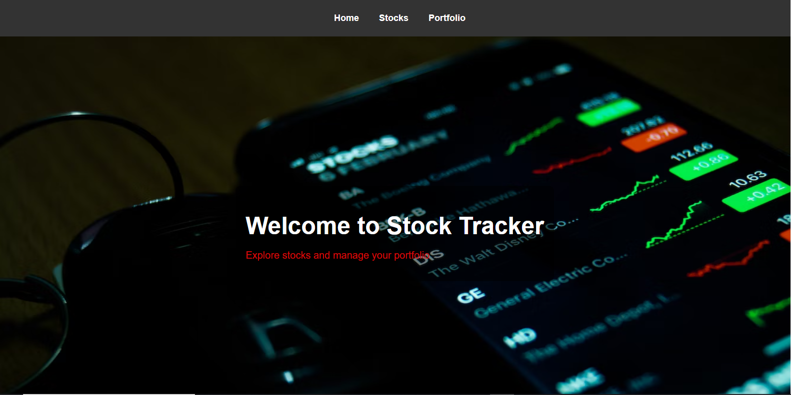
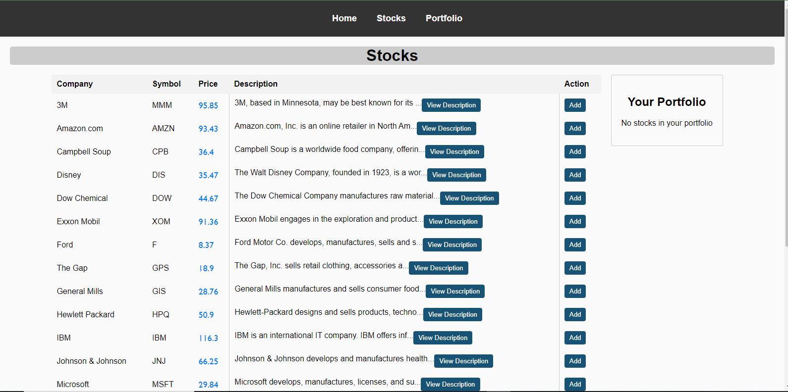
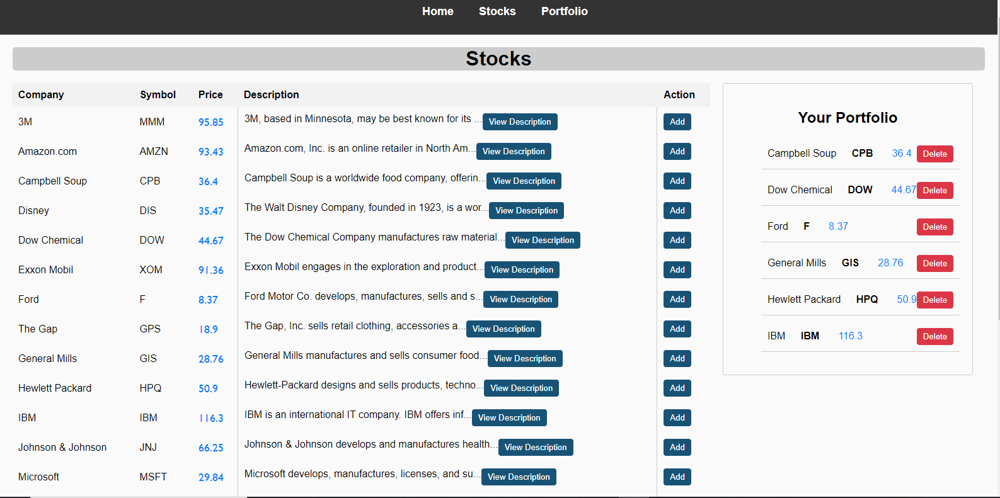

# Stock Tracker App
## Author 
Patrick Maweu 

## Introduction
This is a stock tracking app that displays the stock prices of companies and shows a user's portfolio. 
A user can add stocks to their portfolio and can delete them.
It uses a db.json file as the backend. 

## Features 
- View a list of available stocks 
- Add stocks to your portfolio
- Remove stocks from your portfolio
- View description of stocks in a popup
## Setup 
This app runs locally and you will only need a browser
The backend is node.js 

I uploaded the json data to a json server using [render](https://render.com/){:target="_blank"}

First click on this link to start the json server before starting the app [server](https://stocks-hqcq.onrender.com/)

To start the app click [Stock-Tracker](https://muilipato.github.io/stock-tracker/)

## Routes
`/` Home 

`/stocks` Stocks

`/portfolio` shows Portfolio 

## License 
This project is licensed under the [MIT license](LICENSE).

